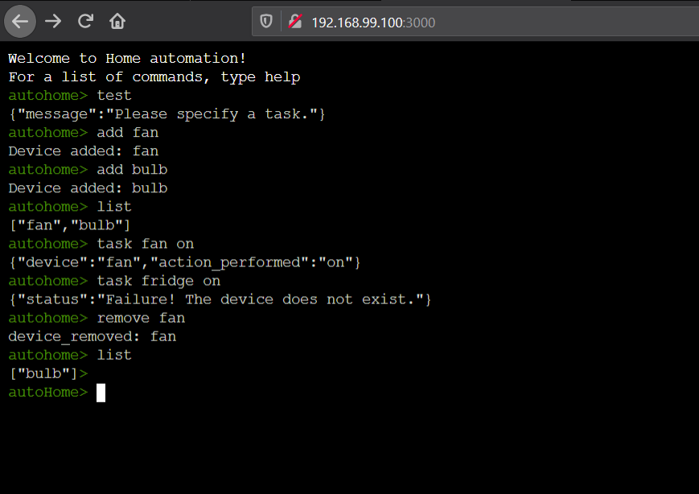

## AutoHome

A prototype REST-ful Home Automation system to remotely control devices at home, built in javascript. Runs in the browser.



# Overview

AutoHome provides the following functionality:

1. Add a device to the system.
2. Remove a device from the system.
3. List all devices in the system.
4. Create a task for a device.

**Note:** Currently the system is not persistent i.e. if you refresh your browser, all data is lost. The data only lasts for the session.

Conversely speaking, you can just refresh your browser to reset the system :D

## Installation

### Using docker-compose [Recommended]

1. Clone this repository.
2. Run ```docker-compose up``` from the root directory.
3. From your browser, go to ```http://192.168.99.100:3000/```, this is where the application console exists.

**Note:** The specific IP address is used because the application is developed on a windows system.

### Manual build [only when docker-compose is not viable]

If for some reason the application can not be built by docker-compose, follow the steps below:

1. Clone this repository.
2. From the root of the repository, ```cd ./device/```
3. ```npm install```
4. ```npm i -g browserify```
5. ```npm i -g mocha``` (skip this step if you don't want to run tests)
6. ```mkdir ./public/build```
7. ```mkdir ./test``` (skip this step if you don't want to run tests)
8. ```browserify public/javascripts/listDevice.js --standalone listDevices > public/build/list.js```
9. ```browserify public/javascripts/addDevice.js --standalone addDevice > public/build/addDevice.js```
10. ```browserify public/javascripts/createTask.js --standalone performTask > public/build/task.js```
11. ```browserify public/javascripts/removeDevice.js --standalone remove > public/build/remove.js```
12. ```browserify public/utils/test.js --standalone testDeviceApi > public/build/test.js```
13. ```browserify public/javascripts/xterms.js > public/build/bundle.js``` 
14. ```npm start```
15. Go to ```http://localhost:3000``` for the application console.

**Note:** As the application is built on windows machine, the IP assigned to docker containers is ```192.168.99.100```. The default docker build uses this address, so for manual build, this address needs to be replaced with ```localhost``` in the following places:

1. ```device/public/javascripts/addDevice.js```
2. ```device/public/javascripts/createTask.js```
3. ```device/public/javascripts/listDevices.js```
4. ```device/public/javascripts/removeDevices.js```
5. ```device/utils/test.js```
6. ```device/test/test-e2e.js``` (skip this step if you don't want to run tests)

## Running tests

1. Install the application by either using docker-compose or manually.
2. Start the application. 
3. From the root of the repository, ```npm test``` (note that you need to have a fresh build of application)

## Console commands:

The web console supports these basic commands:

1. ``list``: Lists all the devices currently available in the automation system.
    Syntax: ```list```
2. ```add```: Adds a single device to the automation system. The name must not contain whitespace.
    Syntax: ```add <name of device>```
3. ```task```: Creates task for a device. The task can not have whitespaces.
    Syntax: ```task <device_name> <task>```
4. ```remove```: Removes specified device from the automation system. The name must not contain whitespace.
    Syntax: ```remove <device_name>```
5. ```test```: Returns a string if the automation system is online.
    Syntax: ```test```
6. ```help```: Prints in-console help.

## Note:

As the application is built on windows machine, there is a chance that the web-console may not start at the IP address as programmed into 
the command handlers. They can be changed from ```192.168.99.100``` to ```localhost``` in the following files:

1. ```device/public/javascripts/addDevice.js```
2. ```device/public/javascripts/createTask.js```
3. ```device/public/javascripts/listDevices.js```
4. ```device/public/javascripts/removeDevices.js```
5. ```device/utils/test.js```
6. ```device/test/test-e2e.js```